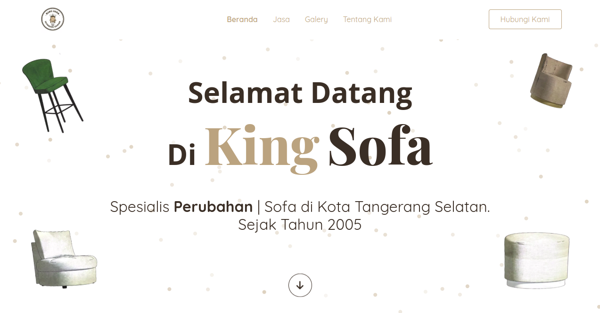

## Required
<ul>
    <li> NodeJS 16.13.0 </li>
</ul>

## Install
<ol>
    <li> git clone https://github.com/korospace/finjop.git </li>
    <li> npm install </li>
    <li> npm run dev </li>
    <li> open http://localhost:8080 </li>
</ol>

## Technology used
<ul>
    <li> 
        <a href="https://gulpjs.com/">Gulp.js</a> 
    </li>
    <li> 
        particle.js
    </li>
    <li> 
        typed.js
    </li>
    <li> 
        GSAP
    </li>
    <li> 
        <a href="https://getbootstrap.com/docs/5.1/getting-started/introduction/">Bootstrap 4</a> 
    </li>
</ul>

## Preview
live demo <a href="https://kingsofa-4a087.web.app/">https://kingsofa-4a087.web.app/</a> 

  